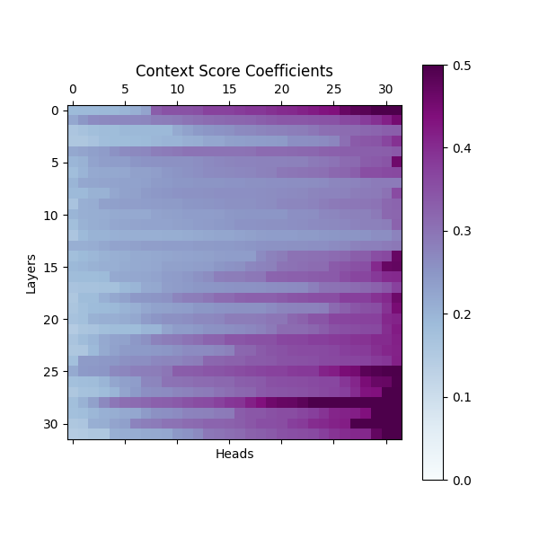
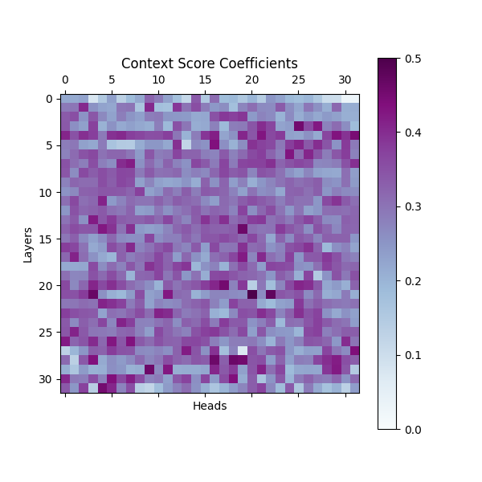

# AcademicLM :microscope: :books:

### Parse and analyze scientific research papers with large language models.

*NOTE:* This project is a work in progress and the following repository is a small portion of it, shared for the purpose of communicating my work. I kindly ask that you please be respectful and careful about using its contents, since it is currently intended for viewing and discussion only.

This library implements a system for extracting insights from scientific papers (which are in the form of pdfs) using large language models.
Specifically, we apply local and open source LLMs towards organized tasks for:
* Document OCR: translating pdf images into markdown, and splitting into paragraph sized chunks.
* Document extraction: systematically collecting data points from chunks of markdown text. 

### Hallucination Detection
To detect hallucinations whilst extracting data, we implement methods from mechanistic 
interpretability to analyze a model's internal features. Specifically, we 
implement the scoring mechanisms as defined in the following study. 

**[Sun, Zhongxiang, et al. "ReDeEP: Detecting Hallucination in Retrieval-Augmented Generation via Mechanistic Interpretability." ICLR. 2025.](https://arxiv.org/abs/2410.11414)**

We compute hallucination detection scores across a model's layers and attention heads, since 
some may be more indicative of hallucination behavior than others. In the example below, 
we notice that a non-hallucinated extraction shows context scores which are more strongly concentrated within 
a few individual attention heads in later layers of the model. For this score, larger values indicate stronger copying (non-hallucination)
behavior. This example is produced using the `meta-llama/Llama-3.1-8B-Instruct` model.

<table>
  <tr>
    <td align="center">
       
      True Extraction
    </td>
    <td align="center">
       
      Hallucinated Extraction
    </td>
  </tr>
</table>

### Basic Usage
We include an example for extracting forest carbon mass measurements in 
`examples/forests.py`.

## License

Copyright (c) 2025 [Kevin Quinn]. All rights reserved.

This repository and its contents are provided for viewing purposes only.
No part of this work may be reproduced, distributed, or used in any form
without the express written permission of the author.

